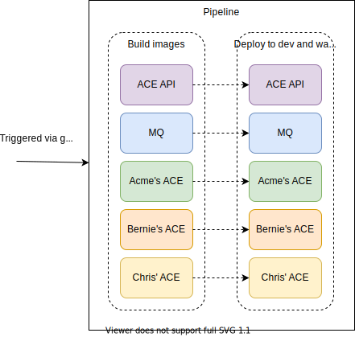
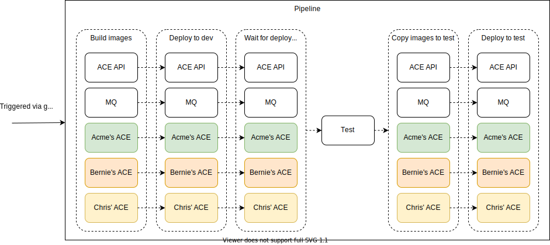
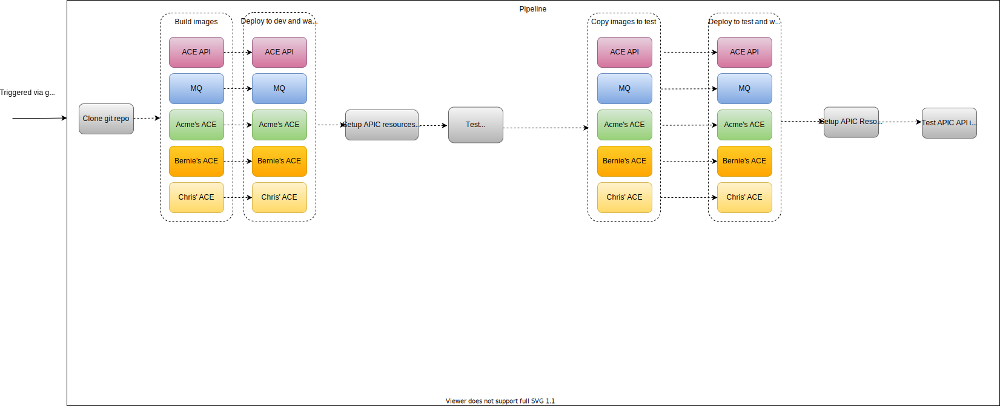

# Overview
This dir is for a demo name "Driveway Dent Deletion". The initial version of this
demo uses a Tekton pipeline to build images and deploy them for 4 App Connect
Integration Servers and 1 MQ server. Future versions of this demo will build
upon this.

# Prerequisites
A [script](prereqs.sh) is provided to setup the prerequisites for this demo
and this script is automatically run as part of the 1-click demo preparation.
The script carries out the following:
- Installs Openshift pipelines from the ocp-4.5 channel
- Creates a project to be used for the demo (default `cp4i`).
- Creates secrets to allow the pipeline to push images to the above project (default `cp4i`).
- Creates a secret to allow the pipeline to pull from the entitled registry
- Creates a username and password for each of the dev (this is the namespace where the 1-click install ran in).
- Creates a database for each of the user.
- Creates a `quotes` table in each database.
- Creates an operator group and product subscriptions.
- Creates the relevant ace configurations (policyproject, keystore, serverconf, setdbparms) to enable https and basic auth for the ace api endpoint
- Releases the platform navigator and ace dashboard.

# User steps
These steps will need to be documented in the demo docs:
- Fork/clone the repo
- Run the script to create the dev pipeline, configured to use the forked repo. Set
`FORKED_REPO` to the URL for your repo and change the `<NAMESPACE>` to the namespace of 1-click install in which you want the pipeline to run.
  ```
  export NAMESPACE=<NAMESPACE>
  oc project $NAMESPACE
  export BRANCH=main
  export FORKED_REPO=https://github.com/IBM/cp4i-deployment-samples.git
  ./cicd-apply-dev-pipeline.sh -n $NAMESPACE -r $FORKED_REPO -b $BRANCH
  ```
- The above script `cicd-apply-dev-pipeline.sh` will create a dev pipeline in the `<NAMESPACE>` namespace and will print the route to add to the webhook in the forked github repo.
- Run the script to create the test pipeline, configured to use the forked repo. Set
`FORKED_REPO` to the URL for your repo and change the `<NAMESPACE>` to the namespace of 1-click install in which you want the pipeline to run.
  ```
  export NAMESPACE=<NAMESPACE>
  oc project $NAMESPACE
  export BRANCH=main
  export FORKED_REPO=https://github.com/IBM/cp4i-deployment-samples.git
  ./cicd-apply-test-pipeline.sh -n $NAMESPACE -r $FORKED_REPO -b $BRANCH
  ```
- The above script `cicd-apply-test-pipeline.sh` will create a dev and test pipeline in the `<NAMESPACE>` namespace and will print the route to add to the webhook in the forked github repo. (This will be the same route as above, but updated to point to a service for the test pipeline in the dev namespace).

  ```
  export NAMESPACE=<NAMESPACE>
  oc project $NAMESPACE
  export BRANCH=main
  export FORKED_REPO=https://github.com/IBM/cp4i-deployment-samples.git
  ./cicd-apply-test-apic-pipeline.sh -n $NAMESPACE -r $FORKED_REPO -b $BRANCH
  ```
- The above script `cicd-apply-test-apic-pipeline.sh` will create a dev and test pipeline with added feature of APIC in the `<NAMESPACE>` namespace and will print the route to add to the webhook in the forked github repo.(This will be the same route as above, but updated to point to a service for the test pipeline in the dev namespace).The pipeline uses the APIC instance already installed on the cluster.

  > :information_source:
  >
  > As part of this pipeline we create a sample consumer org whose owner's credential details can be found in the secret `ddd-dev-api-endpoint-client-id` for dev environment and in `ddd-test-api-endpoint-client-id` for the test environment.
  >
  > Should the user wish to receive the portal admin login reset link they can run 1-click with a set of valid mailtrap credentials and obtain the link from mailtrap.

# Pipelines
## Initial pipeline for just the dev environment

## Pipeline with added support for dev/test environments

## Pipeline with added support for IBM API Connect

## Description of pipeline
- Trigger: Whenever a commit is made to the forked repo it triggers the
  pipeline.
- Clone git repo: Clones this git repo into a workspace PVC that is then used by the rest of the tasks in the pipeline.
- Build images tasks: Each of these tasks builds an image and pushes it to the cluster's local OpenShift Image Registry. The latest dockerfile and related files (bar files) are pulled from the forked git repo.
- Deploy to dev/test and wait for rollout tasks: Each of these tasks applies a CR to deploy/update an MQ/ACE microservice and waits for the deploy/update to rollout so the microservice is running the newly built image once the task has completed.
- Test APIC API in Dev environment: Runs a test of the POST/GET endpoints to verify that the dev environment is working. This acts as a gate for rolling out the change to the test environment.
- Copy images to test tasks: Copies the images from the dev project to the test project (this primarily involves re-tagging the dev image with a new test tag).
- Configure APIC resources task: Creates APIC Product, users, subscription in `Dev provider organisation` and at a later stage, in `test provider organisation`
- Test APIC API in Test environment task: This task will run a final test of the POST/GET endpoints to verify the API published in the APIC catalog in test environment i.e. `test provider org`.
