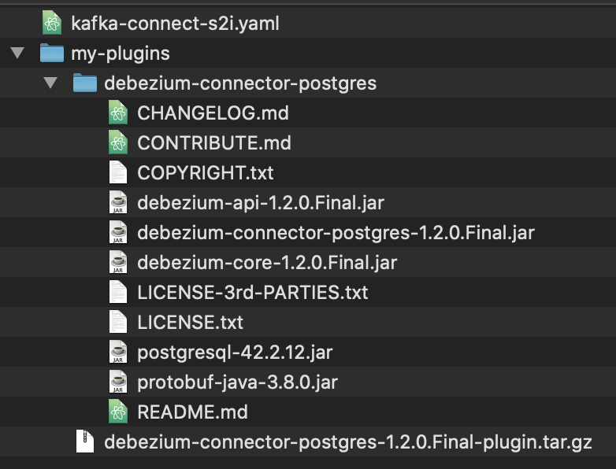

# Overview
This dir is for a demo named "Event Enabled Insurance".

# Prerequisites
A [script](prereqs.sh) is provided to setup the prerequisites for this demo
and this script is automatically run as part of the 1-click demo preparation.
The script carries out the following:
- Installs Openshift pipelines from the ocp-4.4 channel.
- Creates a secret to allow the pipeline to pull from the entitled registry.
- Creates secrets to allow the pipeline to push images to the default project (`cp4i`).
- Creates a username and password for the dev (this is the namespace where the 1-click install ran in).
- Create a username for the postgres for this demo.
- Creates a database for the postfreg for this demo.
- Creates a `QUOTES` table in the database.
- Creates an ACE configuration and dynamic policy xml for postgres in the default namepsace `cp4i`.
- Does some setup to support a Debezium connector:
  - Creates a PUBLICATION named `DB_EEI_QUOTES` for the `QUOTES` table. (The Debezium connector can do this, but would then require super user privileges)
  - Creates a replication user that has the replication role and access to the `QUOTES` table
  - Creates a secret with the replication username/password that can be used by the `KafkaConnector`

# Setting up the Postgres Debezium connector
## Set up a Kafka Connect environment
Navigate to the toolbox for the `es-demo` Event Streams runtime, then click `Set up a Kafka Connect environment` and follow the
instructions. Also configure the KafkaConnectS2I to use a FileConfigProvider to access the `eei-postgres-replication-credential`
created by this demo's prerequisites. The `kafka-connect-s2i.yaml` should look like this:
```
apiVersion: eventstreams.ibm.com/v1beta1
kind: KafkaConnectS2I
metadata:
  name: my-connect-cluster
  annotations:
    eventstreams.ibm.com/use-connector-resources: "true"
spec:
  version: 2.5.0
  replicas: 1
  bootstrapServers: es-demo-kafka-bootstrap:9092                                             # Change 1
  template:
    pod:
      imagePullSecrets: []
      metadata:
        annotations:
          eventstreams.production.type: CloudPakForIntegrationNonProduction
          productID: 2a79e49111f44ec3acd89608e56138f5
          productName: IBM Event Streams for Non Production
          productVersion: 10.0.0
          productMetric: VIRTUAL_PROCESSOR_CORE
          productChargedContainers: my-connect-cluster-connect
          cloudpakId: c8b82d189e7545f0892db9ef2731b90d
          cloudpakName: IBM Cloud Pak for Integration
          cloudpakVersion: 2020.2.1
          productCloudpakRatio: "2:1"
  config:
    group.id: connect-cluster
    offset.storage.topic: connect-cluster-offsets
    config.storage.topic: connect-cluster-configs
    status.storage.topic: connect-cluster-status
    config.storage.replication.factor: 3
    offset.storage.replication.factor: 3
    status.storage.replication.factor: 3
    config.providers: file                                                                   # Change 2
    config.providers.file.class: org.apache.kafka.common.config.provider.FileConfigProvider  # Change 2
  externalConfiguration:                                                                     # Change 3
    volumes:                                                                                 # Change 3
      - name: connector-config                                                               # Change 3
        secret:                                                                              # Change 3
          secretName: eei-postgres-replication-credential                                    # Change 3
#  tls:
#    trustedCertificates:
#      - secretName: quickstart-cluster-ca-cert
#        certificate: ca.crt
#  authentication:
#    type: scram-sha-512
#    username: my-connect-user
#    passwordSecret:
#      secretName: my-connect-user
#      password: my-connect-password-key
```
- Change 1: The `es-demo` Event Streams runtime is setup with no external access, this is the service name of the demo bootstrap server and can only be used within the cluster. Describe the EventStreams CR and note the following section:
  ```
  $ oc describe EventStreams es-demo
  ...
  Kafka Listeners:
    Addresses:
      Host:             es-demo-kafka-bootstrap.cp4i.svc
      Port:             9092
    Bootstrap Servers:  es-demo-kafka-bootstrap.cp4i.svc:9092
    Type:               plain
  ...
  ```
- Change 2: This enables a class that allows reading properties from files
- Change 3: This mounts the `eei-postgres-replication-credential` secret into the connector at `/opt/kafka/external-configuration/connector-config`
- There is no need to change the replication factors, `es-demos` has 3 replicas and so the default value of 3 is appropriate.
- There is no need to add tls or authentication properties, `es-demos` has no security setup.

After applying the `kafka-connect-s2i.yaml` wait for the build to complete. Watch using:
```
oc get build -w
```
Describe the `KafkaConnectS2I` and check that the Conditions section contains a condition with `Type` of `Ready` that has a `Status` of `True`. This may take a little while:
```
$ oc describe KafkaConnectS2I my-connect-cluster
...
Conditions:
  Last Transition Time:  2020-09-02T11:15:03.836Z
  Status:                True
  Type:                  Ready
...
```

## Add connectors to your Kafka Connect environment
Navigate to the toolbox for the `es-demo` Event Streams runtime, then click `Add connectors to your Kafka Connect environment`, then `View Catalog`. Find and click the `PostgreSQL (Debezium)`, then click `Get connector` to download the tgz. Extract the tgz into the `my-plugins` dir to create a dir structure as follows:


Then from the same dir as `kafka-connect-s2i.yaml` run:
```
oc start-build my-connect-cluster-connect --from-dir ./my-plugins/
```

Wait for the build to complete. Watch using:
```
oc get build -w
```

Describe the `KafkaConnectS2I` and check that the `io.debezium.connector.postgresql.PostgresConnector` plugin is listed in the `Connector Plugins` section. This may take a little while:
```
$ oc describe KafkaConnectS2I my-connect-cluster
...
Connector Plugins:
  Class:              io.debezium.connector.postgresql.PostgresConnector
  Type:               source
  Version:            1.2.0.Final
...
```

## Start Kafka Connect with your connectors
Navigate to the toolbox for the `es-demo` Event Streams runtime, then click `Start Kafka Connect with your connectors` and jump to the `Start a connector` section. Take the example connector.yaml and make the following changes to setup the debezium connector:
```
apiVersion: eventstreams.ibm.com/v1alpha1
kind: KafkaConnector
metadata:
  name: my-connector
  labels:
    eventstreams.ibm.com/cluster: my-connect-cluster
spec:
  class: io.debezium.connector.postgresql.PostgresConnector                                                          # Change 1
  tasksMax: 1
  config:
    database.hostname: "postgresql.postgres.svc.cluster.local"                                                       # Change 2
    database.port: "5432"                                                                                            # Change 2
    database.dbname : "${file:/opt/kafka/external-configuration/connector-config/connector.properties:dbName}"       # Change 3
    database.user: "${file:/opt/kafka/external-configuration/connector-config/connector.properties:dbUsername}"      # Change 3
    database.password: "${file:/opt/kafka/external-configuration/connector-config/connector.properties:dbPassword}"  # Change 3
    database.server.name: "sor"                                                                                      # Change 4
    plugin.name: pgoutput                                                                                            # Change 5
    publication.autocreate.mode: disabled                                                                            # Change 6
    publication.name: db_eei_quotes                                                                                  # Change 6
```
- Change 1: This uses the Postgres Debezium plugin added in the previous step.
- Change 2: These are connection details to the Postgres database setup by the prereqs.
- Change 3: This refers to the mounted secret for the credentials to access the database.
- Change 4: This is the prefix used for the topic created by this connector.
- Change 5: The Postgres Debezium connector has various ways of monitoring the Postgres database. We're using Postgres 10 which includes the `pgoutput` plugin by default.
- Change 6: This disables autocreation of a Postgres PUBLICATION and instead uses the one we created as part of the prereqs. This allows the Debezium Connector to connect to Postgres with reduced privileges, to create a PUBLICATION requires superuser privileges.

Apply the yaml using:
```
oc apply -f connector.yaml
```

Find the connector pod and watch the logs:
```
CONNECTOR_POD=$(oc get pod -l eventstreams.ibm.com/cluster=my-connect-cluster --output=jsonpath={.items..metadata.name})
echo "CONNECTOR_POD=${CONNECTOR_POD}"
oc logs -f $CONNECTOR_POD
```

The following should appear in the logs:
```
2020-09-03 07:41:56,537 INFO Snapshot step 1 - Preparing (io.debezium.relational.RelationalSnapshotChangeEventSource) [debezium-postgresconnector-sor-change-event-source-coordinator]
2020-09-03 07:41:56,537 INFO Setting isolation level (io.debezium.connector.postgresql.PostgresSnapshotChangeEventSource) [debezium-postgresconnector-sor-change-event-source-coordinator]
2020-09-03 07:41:56,537 INFO Opening transaction with statement SET TRANSACTION ISOLATION LEVEL SERIALIZABLE, READ ONLY, DEFERRABLE; (io.debezium.connector.postgresql.PostgresSnapshotChangeEventSource) [debezium-postgresconnector-sor-change-event-source-coordinator]
2020-09-03 07:41:56,707 INFO Snapshot step 2 - Determining captured tables (io.debezium.relational.RelationalSnapshotChangeEventSource) [debezium-postgresconnector-sor-change-event-source-coordinator]
2020-09-03 07:41:56,712 INFO Snapshot step 3 - Locking captured tables (io.debezium.relational.RelationalSnapshotChangeEventSource) [debezium-postgresconnector-sor-change-event-source-coordinator]
2020-09-03 07:41:56,713 INFO Waiting a maximum of '10' seconds for each table lock (io.debezium.connector.postgresql.PostgresSnapshotChangeEventSource) [debezium-postgresconnector-sor-change-event-source-coordinator]
2020-09-03 07:41:56,771 INFO Snapshot step 4 - Determining snapshot offset (io.debezium.relational.RelationalSnapshotChangeEventSource) [debezium-postgresconnector-sor-change-event-source-coordinator]
2020-09-03 07:41:56,774 INFO Read xlogStart at '0/15EA6A8' from transaction '566' (io.debezium.connector.postgresql.PostgresSnapshotChangeEventSource) [debezium-postgresconnector-sor-change-event-source-coordinator]
2020-09-03 07:41:56,775 INFO Creating initial offset context (io.debezium.connector.postgresql.PostgresSnapshotChangeEventSource) [debezium-postgresconnector-sor-change-event-source-coordinator]
2020-09-03 07:41:56,777 INFO Read xlogStart at '0/15EA6A8' from transaction '566' (io.debezium.connector.postgresql.PostgresSnapshotChangeEventSource) [debezium-postgresconnector-sor-change-event-source-coordinator]
2020-09-03 07:41:56,779 INFO Snapshot step 5 - Reading structure of captured tables (io.debezium.relational.RelationalSnapshotChangeEventSource) [debezium-postgresconnector-sor-change-event-source-coordinator]
2020-09-03 07:41:56,779 INFO Reading structure of schema 'db_cp4i_sor_eei' (io.debezium.connector.postgresql.PostgresSnapshotChangeEventSource) [debezium-postgresconnector-sor-change-event-source-coordinator]
2020-09-03 07:41:56,848 INFO Snapshot step 6 - Persisting schema history (io.debezium.relational.RelationalSnapshotChangeEventSource) [debezium-postgresconnector-sor-change-event-source-coordinator]
2020-09-03 07:41:56,848 INFO Snapshot step 7 - Snapshotting data (io.debezium.relational.RelationalSnapshotChangeEventSource) [debezium-postgresconnector-sor-change-event-source-coordinator]
2020-09-03 07:41:56,849 INFO 	 Exporting data from table 'public.quotes' (io.debezium.relational.RelationalSnapshotChangeEventSource) [debezium-postgresconnector-sor-change-event-source-coordinator]
2020-09-03 07:41:56,849 INFO 	 For table 'public.quotes' using select statement: 'SELECT * FROM "public"."quotes"' (io.debezium.relational.RelationalSnapshotChangeEventSource) [debezium-postgresconnector-sor-change-event-source-coordinator]
2020-09-03 07:41:56,853 INFO 	 Finished exporting 0 records for table 'public.quotes'; total duration '00:00:00.003' (io.debezium.relational.RelationalSnapshotChangeEventSource) [debezium-postgresconnector-sor-change-event-source-coordinator]
```
And now the connector is monitoring the quotes table and creating events in the `sor.public.quotes` topic.

# The Quote Lifecycle Simulator
## Overview
The Quote Lifecycle Simulator application simulates changes to quotes by adding and modifying rows in the System Of Record database table, also known as the quotes table. See [the Quote Lifecycle Simulator readme](QuoteLifecycleSimulator/readme.md) for more details about the Quote Lifecycle Simulator application.

## Start/stop the Quote Lifecycle Simulator
Start up the Simulator by scaling up the deployment using:
```
oc scale deployment/quote-simulator-eei --replicas=1
```
Watch that the Simulator is inserting/updating rows using:
```
SIMULATOR_POD=$(oc get pod -l app=quote-simulator-eei --output=jsonpath={.items..metadata.name})
echo "SIMULATOR_POD=${SIMULATOR_POD}"
oc logs -f $SIMULATOR_POD
```
You should see output every second with logs something like:
```
2020/09/08 13:31:24 Found mobile claim with quoteID of 9 and claimStatus of 2
2020/09/08 13:31:24 For claim with quoteID of 9, updating claimStatus to 3
2020/09/08 13:31:24 Found non-mobile claim with quoteID of 15 and claimStatus of 1
2020/09/08 13:31:24 For claim with quoteID of 15, updating claimStatus to 2
2020/09/08 13:31:24 Created new claim with id of 16
2020/09/08 13:31:25 Found mobile claim with quoteID of 2 and claimStatus of 1
2020/09/08 13:31:25 For claim with quoteID of 2, updating claimStatus to 2
2020/09/08 13:31:25 Found non-mobile claim with quoteID of 11 and claimStatus of 6
2020/09/08 13:31:25 For claim with quoteID of 11, updating claimStatus to 7
```
View the `sor.public.quotes` topic in Event Streams, new events should appear for every update to the database.

Stop the Simulator using:
```
oc scale deployment/quote-simulator-eei --replicas=0
```
Events should stop appearing in the `sor.public.quotes` topic.

# The Projection Claims application
Start the Projection Claims application using:
```
oc scale deployment/projection-claims-eei --replicas=1
```
Get the URL to open in your web browser using:
```
oc get route projection-claims-eei --template='https://{{.spec.host}}/getalldata'
```
Stop the Projection Claims application using:
```
oc scale deployment/projection-claims-eei --replicas=0
```

# Working directly with the System Of Record database
Setup some env vars
```
POSTGRES_NAMESPACE=postgres
DB_POD=$(oc get pod -n ${POSTGRES_NAMESPACE} -l name=postgresql -o jsonpath='{.items[].metadata.name}')
DB_NAME=$(oc get secret eei-postgres-replication-credential -o json | \
  jq -r '.data["connector.properties"]' | base64 --decode | grep dbName | awk '{print $2}')
```
Get a psql prompt for the database:
```
oc exec -n ${POSTGRES_NAMESPACE} -it $DB_POD -- psql -d ${DB_NAME}
```
Check the rows in the table:
```
db_uuid_sor_eei=# SELECT * FROM QUOTES;
               quoteid                |   source    |     name     |        email        | age |             address             | usstate | licenseplate | descriptionofdamage | claimstatus | claimcost
--------------------------------------+-------------+--------------+---------------------+-----+---------------------------------+---------+--------------+---------------------+-------------+-----------
 f7d2b638-0446-4ea9-a7bd-697bc2c95d52 | Mobile      | Andy Rosales | AndyR@mail.com      |  77 | 9783 Oxford St., Duluth         | GA      | GWL3149      | Won't start         |           3 |          
 427f2916-a746-4548-b9c6-8f344232e636 | Mobile      | Andy Rosales | AndyR@mail.com      |  74 | 9783 Oxford St., Duluth         | GA      | GWL3149      | Cracked windscreen  |           4 |          
 32e3b886-289e-45f3-9d0b-2e461b7235e4 | Mobile      | Nella Beard  | NBeard@mail.com     |  45 | 8774 Inverness Dr., Janesville  | WI      | 787-YWR      | Wheel fell off      |           3 |          
 c2d88eb4-fcb9-4ac9-a5bc-0d23e2bdacb2 | Email       | Andy Rosales | AndyR@mail.com      |  40 | 9783 Oxford St., Duluth         | GA      | GWL3149      | Dent in door        |           1 |          
 dafcf44c-6948-4b20-a0e9-0d6a6a3f2de0 | Mobile      | Andy Rosales | AndyR@mail.com      |  21 | 9783 Oxford St., Duluth         | GA      | GWL3149      | Dent in door        |           3 |          
 ce31003c-77cd-4589-998a-ed74636b7453 | Mobile      | Nella Beard  | NBeard@mail.com     |  50 | 8774 Inverness Dr., Janesville  | WI      | 787-YWR      | Dent in door        |           2 |          
 9ed6cb97-b7e7-42f7-bf7c-f4e073896444 | Web         | Ronny Doyle  | RonnyDoyle@mail.com |  43 | 790 Arrowhead Court, Portsmouth | VA      | WMC-9628     | Dent in door        |           7 |       300
 af52be30-306f-44d9-81cf-81db89995efc | Mobile      | Nella Beard  | NBeard@mail.com     |  60 | 8774 Inverness Dr., Janesville  | WI      | 787-YWR      | Won't start         |           4 |          
 8675ec56-106b-45a1-bfd0-ed9a276e6a19 | Police      | Ronny Doyle  | RonnyDoyle@mail.com |  31 | 790 Arrowhead Court, Portsmouth | VA      | WMC-9628     | Wheel fell off      |           6 |       300
 1a629bd3-15c7-4f13-a702-871077f78281 | Mobile      | Nella Beard  | NBeard@mail.com     |  48 | 8774 Inverness Dr., Janesville  | WI      | 787-YWR      | Won't start         |           5 |       600
 82b475ab-d666-47f8-811a-a8106e664999 | Mobile      | Andy Rosales | AndyR@mail.com      |  59 | 9783 Oxford St., Duluth         | GA      | GWL3149      | Wheel fell off      |           4 |          
 ebe55243-c199-4c00-810d-22336f2137a6 | Email       | Andy Rosales | AndyR@mail.com      |  69 | 9783 Oxford St., Duluth         | GA      | GWL3149      | Won't start         |           1 |          
 72665b87-6493-4a2f-9443-6150c889b43f | Web         | Andy Rosales | AndyR@mail.com      |  30 | 9783 Oxford St., Duluth         | GA      | GWL3149      | Wheel fell off      |           1 |          
 d0bd9c77-573d-425d-91c1-973b500cebe0 | Mobile      | Ronny Doyle  | RonnyDoyle@mail.com |  28 | 790 Arrowhead Court, Portsmouth | VA      | WMC-9628     | Cracked windscreen  |           3 |          
 70374fc4-7910-496f-bbe3-a7b0819036cd | Call Center | Ronny Doyle  | RonnyDoyle@mail.com |  33 | 790 Arrowhead Court, Portsmouth | VA      | WMC-9628     | Cracked windscreen  |           7 |       800
 88953978-770c-4883-899b-fd5d4549d4d2 | Mobile      | Nella Beard  | NBeard@mail.com     |  39 | 8774 Inverness Dr., Janesville  | WI      | 787-YWR      | Dent in door        |           2 |          
 d56e7c3d-a131-4995-bc7c-78a49e641f95 | Police      | Nella Beard  | NBeard@mail.com     |  71 | 8774 Inverness Dr., Janesville  | WI      | 787-YWR      | Cracked windscreen  |           6 |       300
(17 rows)
```
Delete the existing quotes.
```
db_uuid_sor_eei=# DELETE FROM QUOTES;
DELETE 17
```
Exit from the psql prompt:
```
db_uuid_sor_eei=# \q
```

# Reset the events for the sor.public.quotes topic
To remove all of the old events the whole `sor.public.quotes` topic can be deleted.
When further changes are made to the System Of Record table the Debezium connector
will recreate the topic.

To delete the topic.
- Navigate to the `es-demo` Event Streams instance from Navigator
- Click `Topics` on the left hand side
- Click the `...` menu for the `sor.public.quotes` topic
- Choose `Delete this topic`, then `Delete`
