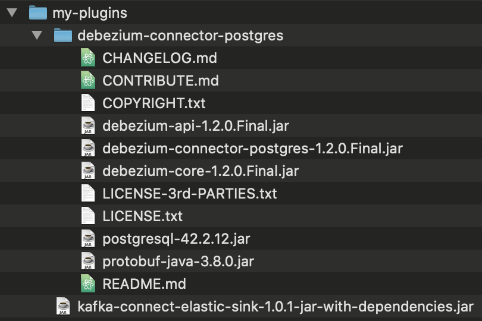

# Overview
This dir is for a demo named "Event Enabled Insurance".

# Prerequisites
A [script](prereqs.sh) is provided to setup the prerequisites for this demo
and this script is automatically run as part of the 1-click demo preparation.
The script carries out the following:
- Installs Openshift pipelines from the ocp-4.4 channel.
- Creates a secret to allow the pipeline to pull from the entitled registry.
- Creates secrets to allow the pipeline to push images to the default project (`cp4i`).
- Creates a username and password for the dev (this is the namespace where the 1-click install ran in).
- Create a username for the postgres for this demo.
- Creates a database for the postfreg for this demo.
- Creates a `QUOTES` table in the database.
- Creates an ACE configuration and dynamic policy xml for postgres in the default namespace `cp4i`.
- Does some setup to support a Debezium connector:
  - Creates a PUBLICATION named `DB_EEI_QUOTES` for the `QUOTES` table. (The Debezium connector can do this, but would then require super user privileges)
  - Creates a replication user that has the replication role and access to the `QUOTES` table
  - Creates a secret with the replication username/password that can be used by the `KafkaConnector`
- Installs Elasticsearch in the `elasticsearch` project. The Elasticsearch CR is also setup to add a `subjectAltNames`
  so the self signed certificate can be used to access the service cross namespace.
- Creates a secret to allow the Elasticsearch connector to connect to Elasticsearch. This secret includes credentials and
  also a truststore in jks format. The truststore includes the self-signed certificate created by Elasticsearch.

# Set up a Kafka Connect environment
Download the [example kafka-connect-s2i.yaml](kafkaconnect/kafka-connect-s2i.yaml). This is based on the one in
the Event Streams toolbox, which can be accessed by:
- Navigate to the toolbox for the `es-demo` Event Streams runtime
- Click `Set up a Kafka Connect environment`

The example includes comments describing each change, see the following:
```yaml
apiVersion: eventstreams.ibm.com/v1beta1
kind: KafkaConnectS2I
metadata:
  name: eei-cluster
  annotations:
    eventstreams.ibm.com/use-connector-resources: "true"
spec:
  # Use the latest version of kafka
  version: 2.6.0
  replicas: 1
  # The `es-demo` Event Streams runtime is setup with no external access. This is the
  # service name of the demo bootstrap server and can only be used within the cluster.
  bootstrapServers: es-demo-kafka-bootstrap:9092
  template:
    pod:
      imagePullSecrets: []
      metadata:
        annotations:
          eventstreams.production.type: CloudPakForIntegrationNonProduction
          productID: 2a79e49111f44ec3acd89608e56138f5
          productName: IBM Event Streams for Non Production
           # Use the latest version of Eventstreams
          productVersion: 10.1.0
          productMetric: VIRTUAL_PROCESSOR_CORE
          productChargedContainers: eei-cluster-connect
          cloudpakId: c8b82d189e7545f0892db9ef2731b90d
          cloudpakName: IBM Cloud Pak for Integration
           # Use the latest version of Eventstreams
          cloudpakVersion: 2020.3.1
          productCloudpakRatio: "2:1"
  config:
    group.id: connect-cluster
    offset.storage.topic: connect-cluster-offsets
    config.storage.topic: connect-cluster-configs
    status.storage.topic: connect-cluster-status
    # There is no need to change the replication factors, `es-demos` has 3 replicas and so
    # the default value of 3 is appropriate.
    config.storage.replication.factor: 3
    offset.storage.replication.factor: 3
    status.storage.replication.factor: 3
    # The followoing 2 properties enable a class that allows reading properties from files.
    config.providers: file
    config.providers.file.class: org.apache.kafka.common.config.provider.FileConfigProvider
  # This mounts secrets into the connector at /opt/kafka/external-configuration. These
  # secrets have been pre-created by the prereqs.sh script and configure access to the
  # demo installs of Postgres and Elasticsearch.
  externalConfiguration:
    volumes:
      - name: postgres-connector-config
        secret:
          secretName: eei-postgres-replication-credential
      - name: elastic-connector-config
        secret:
          secretName: eei-elastic-credential
# There is no need to add tls or authentication properties, `es-demos` has no security
# setup.
#  tls:
#    trustedCertificates:
#      - secretName: quickstart-cluster-ca-cert
#        certificate: ca.crt
#  authentication:
#    type: scram-sha-512
#    username: my-connect-user
#    passwordSecret:
#      secretName: my-connect-user
#      password: my-connect-password-key
```

About the `bootstrapServers` from the above example yaml, the EventStreams CR populates the following fields
once it has started up:
```
$ oc describe EventStreams es-demo
...
Kafka Listeners:
  Addresses:
    Host:             es-demo-kafka-bootstrap.cp4i.svc
    Port:             9092
  Bootstrap Servers:  es-demo-kafka-bootstrap.cp4i.svc:9092
  Type:               plain
...
```

Apply the yaml using:
```
oc apply -f kafka-connect-s2i.yaml
```

Wait for the build to complete. Watch using:
```
oc get build -w
```

Describe the `KafkaConnectS2I` and check that the Status section exists (it will
take a couple of minutes until it added/populated) and the Conditions section contains a
condition with `Type` of `Ready` that has a `Status` of `True`:
```
$ oc describe KafkaConnectS2I eei-cluster
...
Status:
  Build Config Name:  eei-cluster-connect
  Conditions:
    Last Transition Time:  2020-10-09T09:36:39.678538524Z
    Status:                True
    Type:                  Ready
...
```

# Add connectors to your Kafka Connect environment
Add connectors for Postgres Debezium and Elasticsearch.
- Navigate to the toolbox for the `es-demo` Event Streams runtime
- Click `Add connectors to your Kafka Connect environment`
- Click `View Catalog`.
- Find and click the following connectors and the click `Get connector` to download:
  - PostgreSQL (Debezium)
  - Elasticsearch
- Extract the PostgreSQL (Debezium) tgz into a dir named `my-plugins`
- Copy the Elasticsearch jar into the same `my-plugins` dir
You should end up with a dir structure as follows:


Then from the dir above `my-plugins` run:
```
oc start-build eei-cluster-connect --from-dir ./my-plugins/
```

Wait for the build to complete. Watch using:
```
oc get build -w
```

It will take a little while (a couple of minutes) for the plugins to be added. Describe
the `KafkaConnectS2I` and check that the following plugins are listed in the `Connector Plugins`
section:
```
$ oc describe KafkaConnectS2I eei-cluster
...
Connector Plugins:
  Class:              com.ibm.eventstreams.connect.elasticsink.ElasticSinkConnector
  Type:               sink
  Version:            1.0.1
  Class:              io.debezium.connector.postgresql.PostgresConnector
  Type:               source
  Version:            1.2.0.Final
...
```

# Start Kafka Connect with the Postgres (Debezium) connector

Download the [example connector-postgres.yaml](kafkaconnect/connector-postgres.yaml). This is based on the one in
the Event Streams toolbox, which can be accessed by:
- Navigate to the toolbox for the `es-demo` Event Streams runtime
- Click `Start Kafka Connect with your connectors`
- Jump to the `Start a connector` section.
- View the example connector.yaml

The example includes comments describing each change, see the following:
```yaml
apiVersion: eventstreams.ibm.com/v1alpha1
kind: KafkaConnector
metadata:
  name: eei-postgres
  labels:
    eventstreams.ibm.com/cluster: eei-cluster
spec:
  # This uses the Postgres Debezium plugin from the KafkaConnectS2I
  class: io.debezium.connector.postgresql.PostgresConnector
  tasksMax: 1
  config:
    # These are connection details to the Postgres database setup by the prereqs.
    database.hostname: "postgresql.postgres.svc.cluster.local"
    database.port: "5432"
    # The following credentials refer to the mounted secret and use the FileConfigProvider
    # from the KafkaConnectS2I to extract properties from the properties file.
    database.dbname : "${file:/opt/kafka/external-configuration/postgres-connector-config/connector.properties:dbName}"
    database.user: "${file:/opt/kafka/external-configuration/postgres-connector-config/connector.properties:dbUsername}"
    database.password: "${file:/opt/kafka/external-configuration/postgres-connector-config/connector.properties:dbPassword}"
    # This is the prefix used for the topic created by this connector.
    database.server.name: "sor"
    # The Postgres Debezium connector has various ways of monitoring the Postgres database.
    #  We're using Postgres 10 which includes the `pgoutput` plugin by default.
    plugin.name: pgoutput
    # The following settings disable autocreation of a Postgres PUBLICATION and instead use
    # the one we created as part of the prereqs. This allows the Debezium Connector to
    # connect to Postgres with reduced privileges. For this connector to create a PUBLICATION
    # would require the connector to run with superuser privileges.
    publication.autocreate.mode: disabled
    publication.name: db_eei_quotes
```

Apply the yaml using:
```
oc apply -f connector-postgres.yaml
```

Find the connector pod and watch the logs:
```
CONNECTOR_POD=$(oc get pod -l eventstreams.ibm.com/cluster=eei-cluster --output=jsonpath={.items..metadata.name})
echo "CONNECTOR_POD=${CONNECTOR_POD}"
oc logs -f $CONNECTOR_POD
```

The following should appear in the logs (maybe after a minute):
```
2020-10-09 14:09:02,083 INFO Snapshot step 1 - Preparing (io.debezium.relational.RelationalSnapshotChangeEventSource) [debezium-postgresconnector-sor-change-event-source-coordinator]
2020-10-09 14:09:02,083 INFO Setting isolation level (io.debezium.connector.postgresql.PostgresSnapshotChangeEventSource) [debezium-postgresconnector-sor-change-event-source-coordinator]
2020-10-09 14:09:02,083 INFO Opening transaction with statement SET TRANSACTION ISOLATION LEVEL SERIALIZABLE, READ ONLY, DEFERRABLE; (io.debezium.connector.postgresql.PostgresSnapshotChangeEventSource) [debezium-postgresconnector-sor-change-event-source-coordinator]
2020-10-09 14:09:02,186 INFO Snapshot step 2 - Determining captured tables (io.debezium.relational.RelationalSnapshotChangeEventSource) [debezium-postgresconnector-sor-change-event-source-coordinator]
2020-10-09 14:09:02,189 INFO Snapshot step 3 - Locking captured tables (io.debezium.relational.RelationalSnapshotChangeEventSource) [debezium-postgresconnector-sor-change-event-source-coordinator]
2020-10-09 14:09:02,190 INFO Waiting a maximum of '10' seconds for each table lock (io.debezium.connector.postgresql.PostgresSnapshotChangeEventSource) [debezium-postgresconnector-sor-change-event-source-coordinator]
2020-10-09 14:09:02,228 INFO Snapshot step 4 - Determining snapshot offset (io.debezium.relational.RelationalSnapshotChangeEventSource) [debezium-postgresconnector-sor-change-event-source-coordinator]
2020-10-09 14:09:02,230 INFO Read xlogStart at '0/15E8B80' from transaction '569' (io.debezium.connector.postgresql.PostgresSnapshotChangeEventSource) [debezium-postgresconnector-sor-change-event-source-coordinator]
2020-10-09 14:09:02,231 INFO Creating initial offset context (io.debezium.connector.postgresql.PostgresSnapshotChangeEventSource) [debezium-postgresconnector-sor-change-event-source-coordinator]
2020-10-09 14:09:02,232 INFO Read xlogStart at '0/15E8B80' from transaction '569' (io.debezium.connector.postgresql.PostgresSnapshotChangeEventSource) [debezium-postgresconnector-sor-change-event-source-coordinator]
2020-10-09 14:09:02,233 INFO Snapshot step 5 - Reading structure of captured tables (io.debezium.relational.RelationalSnapshotChangeEventSource) [debezium-postgresconnector-sor-change-event-source-coordinator]
2020-10-09 14:09:02,233 INFO Reading structure of schema 'db_dan_sor_eei' (io.debezium.connector.postgresql.PostgresSnapshotChangeEventSource) [debezium-postgresconnector-sor-change-event-source-coordinator]
2020-10-09 14:09:02,277 INFO Snapshot step 6 - Persisting schema history (io.debezium.relational.RelationalSnapshotChangeEventSource) [debezium-postgresconnector-sor-change-event-source-coordinator]
2020-10-09 14:09:02,277 INFO Snapshot step 7 - Snapshotting data (io.debezium.relational.RelationalSnapshotChangeEventSource) [debezium-postgresconnector-sor-change-event-source-coordinator]
2020-10-09 14:09:02,277 INFO 	 Exporting data from table 'public.quotes' (io.debezium.relational.RelationalSnapshotChangeEventSource) [debezium-postgresconnector-sor-change-event-source-coordinator]
2020-10-09 14:09:02,278 INFO 	 For table 'public.quotes' using select statement: 'SELECT * FROM "public"."quotes"' (io.debezium.relational.RelationalSnapshotChangeEventSource) [debezium-postgresconnector-sor-change-event-source-coordinator]
2020-10-09 14:09:02,280 INFO 	 Finished exporting 0 records for table 'public.quotes'; total duration '00:00:00.003' (io.debezium.relational.RelationalSnapshotChangeEventSource) [debezium-postgresconnector-sor-change-event-source-coordinator]
```
And now the connector is monitoring the quotes table and creating events in the `sor.public.quotes` topic.

# The Quote Lifecycle Simulator
## Overview
The Quote Lifecycle Simulator application simulates changes to quotes by adding and modifying rows in the System Of Record database table, also known as the quotes table. See [the Quote Lifecycle Simulator readme](QuoteLifecycleSimulator/readme.md) for more details about the Quote Lifecycle Simulator application.

## Start/stop the Quote Lifecycle Simulator
Start up the Simulator by scaling up the deployment using:
```
oc scale deployment/quote-simulator-eei --replicas=1
```
Watch that the Simulator is inserting/updating rows using:
```
SIMULATOR_POD=$(oc get pod -l app=quote-simulator-eei --output=jsonpath={.items..metadata.name})
echo "SIMULATOR_POD=${SIMULATOR_POD}"
oc logs -f $SIMULATOR_POD
```
You should see output every second with logs something like:
```
2020/10/09 14:10:04 Found mobile claim with quoteID of 4e7e14fa-d242-4ad5-ae01-c554b7650430 and claimStatus of 1
2020/10/09 14:10:04 For claim with quoteID of 4e7e14fa-d242-4ad5-ae01-c554b7650430, updating claimStatus to 2
2020/10/09 14:10:04 No outstanding non-mobile claims found
2020/10/09 14:10:05 Found mobile claim with quoteID of 12abfe16-0c41-42a4-9edb-201f79ef05c2 and claimStatus of 1
2020/10/09 14:10:05 For claim with quoteID of 12abfe16-0c41-42a4-9edb-201f79ef05c2, updating claimStatus to 2
2020/10/09 14:10:05 No outstanding non-mobile claims found
2020/10/09 14:10:06 Found mobile claim with quoteID of 5a91ca69-0dd7-41ad-8d65-d7d4d8d55dea and claimStatus of 1
2020/10/09 14:10:06 For claim with quoteID of 5a91ca69-0dd7-41ad-8d65-d7d4d8d55dea, updating claimStatus to 2
2020/10/09 14:10:06 No outstanding non-mobile claims found
2020/10/09 14:10:06 Created new claim with id of c567cb9d-d296-4a41-96e0-a49d18d57c60
```
View the `sor.public.quotes` topic in Event Streams, new events should appear for every update to the database.

Stop the Simulator using:
```
oc scale deployment/quote-simulator-eei --replicas=0
```
Events should stop appearing in the `sor.public.quotes` topic.

# The Projection Claims application
Start the Projection Claims application using:
```
oc scale deployment/projection-claims-eei --replicas=1
```
Get the URL to open in your web browser using:
```
echo $(oc get route projection-claims-eei --template='https://{{.spec.host}}/getalldata')
```
Stop the Projection Claims application using:
```
oc scale deployment/projection-claims-eei --replicas=0
```

# Start Kafka Connect with the Elasticsearch connector

Download the [example connector-elastic.yaml](kafkaconnect/connector-elastic.yaml). This is based on the one in
the Event Streams toolbox, which can be accessed by:
- Navigate to the toolbox for the `es-demo` Event Streams runtime
- Click `Start Kafka Connect with your connectors`
- Jump to the `Start a connector` section.
- View the example connector.yaml

The example includes comments describing each change, see the following:
```yaml
apiVersion: eventstreams.ibm.com/v1alpha1
kind: KafkaConnector
metadata:
  name: eei-elastic
  labels:
    eventstreams.ibm.com/cluster: eei-cluster
spec:
  # This uses the Elasticsearch plugin from the KafkaConnectS2I
  class: com.ibm.eventstreams.connect.elasticsink.ElasticSinkConnector
  tasksMax: 1
  config:
    # Monitors the topic that is being populated by the postgres connector.
    topics: sor.public.quotes
    # The following credentials refer to the mounted secret and use the FileConfigProvider
    # from the KafkaConnectS2I to extract properties from the properties file.
    es.connection: "${file:/opt/kafka/external-configuration/elastic-connector-config/connector.properties:dbConnection}"
    es.user.name: "${file:/opt/kafka/external-configuration/elastic-connector-config/connector.properties:dbUser}"
    es.password: "${file:/opt/kafka/external-configuration/elastic-connector-config/connector.properties:dbPassword}"
    # Use the default document/index builders
    es.document.builder: com.ibm.eventstreams.connect.elasticsink.builders.JsonDocumentBuilder
    es.index.builder: com.ibm.eventstreams.connect.elasticsink.builders.DefaultIndexBuilder
    # Use the KeyIdentifierBuilder to do CDC, so the Elasticsearch index only includes
    # the latest copy of all rows from the original data.
    es.identifier.builder: com.ibm.eventstreams.connect.elasticsink.builders.KeyIdentifierBuilder
    # Setup the truststore to trust the Elasticsearch self signed certificate. The Elasticsearch
    # operator creates this certificate and the prereqs create a jks truststore from it and
    # add it to a secret that gets mounted into the connector pod.
    es.tls.truststore.location: /opt/kafka/external-configuration/elastic-connector-config/elastic-ts.jks
    es.tls.truststore.password: "${file:/opt/kafka/external-configuration/elastic-connector-config/connector.properties:truststorePassword}"
```

Apply the yaml using:
```
oc apply -f connector-elastic.yaml
```

Find the connector pod and watch the logs:
```
CONNECTOR_POD=$(oc get pod -l eventstreams.ibm.com/cluster=eei-cluster --output=jsonpath={.items..metadata.name})
echo "CONNECTOR_POD=${CONNECTOR_POD}"
oc logs -f $CONNECTOR_POD
```

The following should appear in the logs:
```
2020-10-09 14:12:34,522 INFO Building documents using com.ibm.eventstreams.connect.elasticsink.builders.JsonDocumentBuilder (com.ibm.eventstreams.connect.elasticsink.builders.JsonDocumentBuilder) [task-thread-eei-elastic-0]
2020-10-09 14:12:35,075 INFO Connection to Elasticsearch established (com.ibm.eventstreams.connect.elasticsink.ElasticWriter) [task-thread-eei-elastic-0]
2020-10-09 14:12:35,076 INFO WorkerSinkTask{id=eei-elastic-0} Sink task finished initialization and start (org.apache.kafka.connect.runtime.WorkerSinkTask) [task-thread-eei-elastic-0]
2020-10-09 14:12:38,853 INFO WorkerSinkTask{id=eei-elastic-0} Committing offsets asynchronously using sequence number 1: {sor.public.quotes-0=OffsetAndMetadata{offset=65, leaderEpoch=null, metadata=''}} (org.apache.kafka.connect.runtime.WorkerSinkTask) [task-thread-eei-elastic-0]
```
And now the connector is monitoring the `sor.public.quotes` topic and writing to the `sor.public.quotes` index in Elasticsearch.

# Verify contents of Elasticsearch
Portforward the Elasticsearch service to your localhost:
```
ELASTIC_NAMESPACE=elasticsearch
oc port-forward -n ${ELASTIC_NAMESPACE} service/elasticsearch-eei-es-http 9200
```

In a separate terminal setup some env vars to allow curl to call Elasticsearch:
```
ELASTIC_NAMESPACE=elasticsearch
ELASTIC_PASSWORD=$(oc get secret elasticsearch-eei-es-elastic-user -n $ELASTIC_NAMESPACE -o go-template='{{.data.elastic | base64decode}}')
ELASTIC_USER="elastic"
```

Check that the `sor.public.quotes` index has been created using the command:
```
curl -u "${ELASTIC_USER}:${ELASTIC_PASSWORD}" -k 'https://localhost:9200/_cat/indices?v'
```
Which should return something like:
```
health status index             uuid                   pri rep docs.count docs.deleted store.size pri.store.size
yellow open   sor.public.quotes fb59dXjURR6uCxRwoRpaIQ   1   1         18           47     39.7kb         39.7kb
```

Get the current state of the `sor.public.quotes` index into an env var named `JSON`:
```
JSON=$(curl -u "${ELASTIC_USER}:${ELASTIC_PASSWORD}" -k "https://localhost:9200/sor.public.quotes/_search" -H 'Content-Type: application/json' -d'{"query":{"match_all":{}}}')
```

Get the number of rows from the JSON using:
```
echo $JSON | jq .hits.total.value
```

Get the rows from the JSON using:
```
echo $JSON | jq '.hits.hits[]._source.after'
```
Which should return something like:
```
{
  "quoteid": "22d3ae0a-3498-4207-ae99-b7fe584f6c1b",
  "source": "Mobile",
  "name": "Nella Beard",
  "email": "NBeard@mail.com",
  "age": 45,
  "address": "8774 Inverness Dr., Janesville",
  "usstate": "WI",
  "licenseplate": "787-YWR",
  "descriptionofdamage": "Wheel fell off",
  "claimstatus": 2,
  "claimcost": null
}
{
  "quoteid": "12abfe16-0c41-42a4-9edb-201f79ef05c2",
  "source": "Mobile",
  "name": "Andy Rosales",
  "email": "AndyR@mail.com",
  "age": 77,
  "address": "9783 Oxford St., Duluth",
  "usstate": "GA",
  "licenseplate": "GWL3149",
  "descriptionofdamage": "Won't start",
  "claimstatus": 3,
  "claimcost": null
}
...
```

To delete the index:
```
curl -X DELETE -u "${ELASTIC_USER}:${ELASTIC_PASSWORD}" -k https://localhost:9200/sor.public.quotes
```

# Working directly with the System Of Record database
Setup some env vars
```
POSTGRES_NAMESPACE=postgres
DB_POD=$(oc get pod -n ${POSTGRES_NAMESPACE} -l name=postgresql -o jsonpath='{.items[].metadata.name}')
DB_NAME=$(oc get secret eei-postgres-replication-credential -o json | \
  jq -r '.data["connector.properties"]' | base64 --decode | grep dbName | awk '{print $2}')
```
Get a psql prompt for the database:
```
oc exec -n ${POSTGRES_NAMESPACE} -it $DB_POD -- psql -d ${DB_NAME}
```
Check the rows in the table:
```
db_uuid_sor_eei=# SELECT * FROM QUOTES;
               quoteid                |   source    |     name     |        email        | age |             address             | usstate | licenseplate | descriptionofdamage | claimstatus | claimcost
--------------------------------------+-------------+--------------+---------------------+-----+---------------------------------+---------+--------------+---------------------+-------------+-----------
 f7d2b638-0446-4ea9-a7bd-697bc2c95d52 | Mobile      | Andy Rosales | AndyR@mail.com      |  77 | 9783 Oxford St., Duluth         | GA      | GWL3149      | Won't start         |           3 |          
 427f2916-a746-4548-b9c6-8f344232e636 | Mobile      | Andy Rosales | AndyR@mail.com      |  74 | 9783 Oxford St., Duluth         | GA      | GWL3149      | Cracked windscreen  |           4 |          
 32e3b886-289e-45f3-9d0b-2e461b7235e4 | Mobile      | Nella Beard  | NBeard@mail.com     |  45 | 8774 Inverness Dr., Janesville  | WI      | 787-YWR      | Wheel fell off      |           3 |          
 c2d88eb4-fcb9-4ac9-a5bc-0d23e2bdacb2 | Email       | Andy Rosales | AndyR@mail.com      |  40 | 9783 Oxford St., Duluth         | GA      | GWL3149      | Dent in door        |           1 |          
 dafcf44c-6948-4b20-a0e9-0d6a6a3f2de0 | Mobile      | Andy Rosales | AndyR@mail.com      |  21 | 9783 Oxford St., Duluth         | GA      | GWL3149      | Dent in door        |           3 |          
 ce31003c-77cd-4589-998a-ed74636b7453 | Mobile      | Nella Beard  | NBeard@mail.com     |  50 | 8774 Inverness Dr., Janesville  | WI      | 787-YWR      | Dent in door        |           2 |          
 9ed6cb97-b7e7-42f7-bf7c-f4e073896444 | Web         | Ronny Doyle  | RonnyDoyle@mail.com |  43 | 790 Arrowhead Court, Portsmouth | VA      | WMC-9628     | Dent in door        |           7 |       300
 af52be30-306f-44d9-81cf-81db89995efc | Mobile      | Nella Beard  | NBeard@mail.com     |  60 | 8774 Inverness Dr., Janesville  | WI      | 787-YWR      | Won't start         |           4 |          
 8675ec56-106b-45a1-bfd0-ed9a276e6a19 | Police      | Ronny Doyle  | RonnyDoyle@mail.com |  31 | 790 Arrowhead Court, Portsmouth | VA      | WMC-9628     | Wheel fell off      |           6 |       300
 1a629bd3-15c7-4f13-a702-871077f78281 | Mobile      | Nella Beard  | NBeard@mail.com     |  48 | 8774 Inverness Dr., Janesville  | WI      | 787-YWR      | Won't start         |           5 |       600
 82b475ab-d666-47f8-811a-a8106e664999 | Mobile      | Andy Rosales | AndyR@mail.com      |  59 | 9783 Oxford St., Duluth         | GA      | GWL3149      | Wheel fell off      |           4 |          
 ebe55243-c199-4c00-810d-22336f2137a6 | Email       | Andy Rosales | AndyR@mail.com      |  69 | 9783 Oxford St., Duluth         | GA      | GWL3149      | Won't start         |           1 |          
 72665b87-6493-4a2f-9443-6150c889b43f | Web         | Andy Rosales | AndyR@mail.com      |  30 | 9783 Oxford St., Duluth         | GA      | GWL3149      | Wheel fell off      |           1 |          
 d0bd9c77-573d-425d-91c1-973b500cebe0 | Mobile      | Ronny Doyle  | RonnyDoyle@mail.com |  28 | 790 Arrowhead Court, Portsmouth | VA      | WMC-9628     | Cracked windscreen  |           3 |          
 70374fc4-7910-496f-bbe3-a7b0819036cd | Call Center | Ronny Doyle  | RonnyDoyle@mail.com |  33 | 790 Arrowhead Court, Portsmouth | VA      | WMC-9628     | Cracked windscreen  |           7 |       800
 88953978-770c-4883-899b-fd5d4549d4d2 | Mobile      | Nella Beard  | NBeard@mail.com     |  39 | 8774 Inverness Dr., Janesville  | WI      | 787-YWR      | Dent in door        |           2 |          
 d56e7c3d-a131-4995-bc7c-78a49e641f95 | Police      | Nella Beard  | NBeard@mail.com     |  71 | 8774 Inverness Dr., Janesville  | WI      | 787-YWR      | Cracked windscreen  |           6 |       300
(17 rows)
```
Delete the existing quotes.
```
db_uuid_sor_eei=# DELETE FROM QUOTES;
DELETE 17
```
Exit from the psql prompt:
```
db_uuid_sor_eei=# \q
```

# Reset the events for the sor.public.quotes topic
To remove all of the old events the whole `sor.public.quotes` topic can be deleted.
When further changes are made to the System Of Record table the Debezium connector
will recreate the topic.

To delete the topic.
- Navigate to the `es-demo` Event Streams instance from Navigator
- Click `Topics` on the left hand side
- Click the `...` menu for the `sor.public.quotes` topic
- Choose `Delete this topic`, then `Delete`
